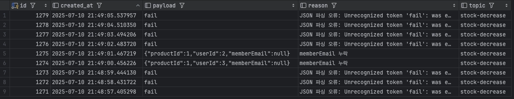

# PRODUCT API
## 개요
- 트래픽 증가 환경에서 성능과 확장성을 검증한 백엔드 API 프로젝트
- 운영 환경 기반 부하 테스트(nGrinder)로 성능 지표를 측정하고 병목을 분석·개선
<br>

# Architecture


## 주요기능
- 상품 등록(Create)
- 상품 조회(Read)
- 상품 수정(Update)
- 상품 삭제(Delete)
<br>

## 기술스택
- Java17
- Spring Boot
- JPA
- MySQL
- Docker
- AWS
- Ngnix
- Redis
- Grafana
- Prometheus
- Kafka
<br>
<br>

## 분산 환경 성능 테스트 비교(상품 조회)
데이터 30,000개로 진행(DB maximum pool size = 10) -> OOM 발생(메모리 사용률 98%) -> 에러율 30% 이상
<br>

```
2025-06-10T09:17:22.059Z ERROR 1 --- [test-repo-java] [io-8080-exec-45] o.a.c.c.C.[Tomcat].[localhost]: Exception Processing [ErrorPage[errorCode=0, location=/error]]
jakarta.servlet.ServletException: Handler dispatch failed: java.lang.OutOfMemoryError: Java heap space at …
```
1. DB maximum pool size 10 -> 50 증가
2. Vusers를 최대 75로 제한(최대치 이상으로 하면 OOM 발생)

<br>

### Local(Vuser 증가 25 -> 50 -> 75)
✔️Application Instance(1~3)   ✔️Ngnix   ✔️Ngrinder(controller, agent)   ✔️MySql <br>
<br>
Duration : 300(sec), Data : 30,000, **Vuser : 25**<br>
| 구성 환경 | TPS (평균) | 응답시간 평균 (ms) | 응답시간 최소 (ms) | 응답시간 최대 (ms) | 에러율 (%) |비고 |
|---------|-----------|------------------|------------------|------------------|-----------|-----------|
| 단일 인스턴스 | 80.1 | 297.0 | 13.5 | 119.0 | 0% | |
| Nginx + 인스턴스 2개 | 33.1 | 718.7 | 6.0 | 50.0 | 0.01% | least_conn X
| Nginx + 인스턴스 3개 | 31.2 | 762.66 | 20.0 | 45.5 | 0% | least_conn O

<br>

### least_conn 추가 
Nginx + 인스턴스 2개 부하 테스트 - 에러율이 한 곳에서 치솟는 현상 발견


| 적용 전 (least_conn ❌) | 적용 후 (least_conn ⭕) |
|------------------------|------------------------|
|||
|33:15부터 1.3초에 가까운 GC 발생 <br>-> 에러 발생시점과 일치하다 판단<br><br> product-api-1(초록색)과 product-api-2(노란색) 그래프 차이 존재<br> → 부하 쏠림 예측|추가 후 2개의 그래프 비슷해짐 <br>-> 이전보다 균등하게 분배되었다고 판단(y축 값도 작아짐)|
|||
|주황색(product-api-2) 00:33 ~ 00:35 사이 Eden 공간이 급증<br> → GC 예측<br><br>파란색(product-api-1)에 비해 높은 것으로 보아 부하 쏠림 가능성 존재|파란색(product-api-1)의 변화폭 증가<br> → 부하가 이전보다 균등하게 배분된다고 판단|
<br>

Nginx + 인스턴스 2개 부하 테스트 <br>
| 구성 환경 | TPS (평균) | 응답시간 평균 (ms) | 응답시간 최소 (ms) | 응답시간 최대 (ms) | 에러율 (%) |
|---------|-----------|------------------|------------------|------------------|-----------|
| least_conn 추가 전 | 33.1| 718.7| 6 | 50.0 | 0.01% |
| least_conn 추가 후 | 34.1 | 699.5 | 14.5 | 50.5 | 0% |

User의 수가 크지 않아 값의 변화는 작지만, 테스트를 3차례 추가 시도시 에러는 0%로 발생하지 않았음
<br>
<br>

Duration : 300(sec), Data : 30,000, **Vuser : 50**, least_conn 추가<br>
| 구성 환경 | TPS (평균) | 응답시간 평균 (ms) | 응답시간 최소 (ms) | 응답시간 최대 (ms) | 에러율 (%) |
|---------|-----------|------------------|------------------|------------------|-----------|
| 단일 인스턴스 | 63.7 | 781.9 | 38.0 | 109.5 | 0% |
| Nginx + 인스턴스 2개 | 25.4 | 1954.2 | 8.5 | 38.5 | 0.07% |
| Nginx + 인스턴스 3개 | 25.8 | 1906.1 | 7.5 | 41.5 | 0.43% |

<br>

Duration : 300(sec), Data : 30,000, **Vuser : 75**, least_conn 추가<br>
| 구성 환경 | TPS (평균) | 응답시간 평균 (ms) | 응답시간 최소 (ms) | 응답시간 최대 (ms) | 에러율 (%) |
|---------|-----------|------------------|------------------|------------------|-----------|
| 단일 인스턴스 | 68.9 | 1072.2 | 15.5 | 101.5 | 0% |
| Nginx + 인스턴스 2개 | 26.7 | 2661.1 | 3.5 | 38.0 | 1.67% |
| Nginx + 인스턴스 3개 | 23.0 | 3146.8 | 7.5 | 35.0 | 1.05% |

<br>

>**로컬에서 개발 환경 진행**<br>
테스트 진행 중 웹 브라우저 사용, 음악 재생 등 다른 프로세스의 리소스 사용이 일부 지표에 영향을 미쳤을 가능성 존재<br>
<br>**보완** <br>
동일한 테스트 시나리오를 AWS EC2 기반 독립 환경에서 다시 수행하여 외부 요인의 영향을 최소화한 상태에서 성능을 재검증


### AWS(EC2, Vuser 증가 25 -> 50 -> 75)
✔️t2.micro <br>
✔️Application Instance(1~3)   ✔️Ngnix   ✔️Ngrinder(controller, agent)   ✔️MySql
<br>
<br>Duration : 300(sec), Data : 30,000, **Vuser : 25**<br>
| 구성 환경 | TPS (평균) | 응답시간 평균 (ms) | 응답시간 최소 (ms) | 응답시간 최대 (ms) | 에러율 (%) |
|---------|-----------|------------------|------------------|------------------|-----------|
| 단일 인스턴스 | 20.1 | 1158.82 | 2 | 29 | 0.40% |
| Nginx + 인스턴스 2개 | 45.0 | 527.21 | 19 | 57.5 | 0% |
| Nginx + 인스턴스 3개 | 64.9 | 366.19 | 37 | 85 | 0% |

<br>Duration : 300(sec), Data : 30,000, **Vuser : 50**<br>
| 구성 환경 | TPS (평균) | 응답시간 평균 (ms) | 응답시간 최소 (ms) | 응답시간 최대 (ms) | 에러율 (%) |
|---------|------------|-------------------|-------------------|-------------------|-----------|
| 단일 인스턴스 | 8.1 | 0.23 | 0 | 25 | 48.47 |
| Nginx + 인스턴스 2개 | 23.7 | 105.26 | 0 | 33.5 | 24.71 |
| Nginx + 인스턴스 3개 | 41.0 | 130.50 | 31 | 76 | 15.14 |


GC 일시정지 시간이 최대 1초가 나와 사용자 요청 처리가 지연되거나 응답 속도가 늦어져 에러율 증가로 예측

<br>

<br>Duration : 300(sec), Data : 30,000, **Vuser : 75**<br>
| 구성 환경 | TPS (평균) | 응답시간 평균 (ms) | 최소 TPS (ms) | 최대 TPS (ms) | 에러율 (%) |
|---------|------------|-------------------|--------------|--------------|-----------|
| 단일 인스턴스 | 12.2 | 0.35 | 0 | 37 | 49.48 |
| Nginx + 인스턴스 2개 | 29.9 | 165.12 | 5.5 | 54 | 27.47 |
| Nginx + 인스턴스 3개 | 41.8 | 248.20 | 17 | 68.5 | 19.93 |

<br>

Nginx + 인스턴스 2개


파란색 네모 -> User 75 분홍색 네모 -> User : 50 보라색 네모 -> USer : 25

```
java.sql.SQLTransientConnectionException:
HikariPool-1 - Connection is not available, request timed out after 34007ms (total=49, active=48, idle=1, waiting=50)
```

User가 50이상일 경우 모든 DB connection 수 사용 -> 그 이상의 요청이 오는 경우 waiting -> 에러율 증가

<br>
Nginx + 인스턴스 3개
<br>


8080 인스턴스에 요청이 압도적으로 몰리고 있는 불균형 상황(보라색 네모) <br>
- (첫번째 사진) 활성 커넥션 수가 풀 최대 사이즈(50)에 육박 -> 거의 사용 중 <br>
- (두번째 사진) pending 수가 약 90까지 치솟음 <br>
- weight를 따로 주지 않았음에도 nginx가 불균등하게 트래픽을 분배한다고 판단 -> least_conn 방식 추가


<br>

| TPS (평균) | 응답시간 평균 (ms) | 최소 TPS (ms) | 최대 TPS (ms) | 에러율 (%) |
|-----------|-------------------|--------------|--------------|-----------|
| 41.8 | 248.20 | 17 | 68.5 | 19.93 |
| 34.5 | 1051.39 | 9 | 56.5 | 15.00 |

least_conn 추가 후 에러율 약 5% 감소

<br>

Nginx + 인스턴스 3개 + least_conn 추가


에러율은 약 5% 감소했지만 응답시간이 증가 -> 3개 인스턴스 connection이 거의 다 사용중이기 때문이라 추측 <br>
커넥션 풀 포화 -> 대기 요청 증가 -> 평균 응답시간 증가 -> TPS 감소

추가 ) Nginx + 인스턴스 3개 로그

```
2025-06-18T02:39:02.469Z ERROR 1 --- [test-repo-java] [io-8080-exec-13] o.a.c.c.C.[.[.[/].[dispatcherServlet]:
Servlet.service() for servlet [dispatcherServlet] in context with path [] threw exception [Request processing failed:
java.lang.RuntimeException: java.lang.OutOfMemoryError: Java heap space] with root cause

java.lang.OutOfMemoryError: Java heap space

java.sql.SQLTransientConnectionException:
HikariPool-1 - Connection is not available, request timed out after 48543ms (total=26, active=25, idle=1, waiting=0)
```
OOM 발생 -> max pool size 50임에도 26~33개 생성 -> 메모리가 부족해서 커넥션을 더 못 만드는 것으로 판단 <br>
(local 환경 : MacBook M1 Pro // AWS : t2.micro) 

## DB 부하 테스트(특정 상품 1개 조회)
### AWS(EC2)
✔️t2.micro <br>
✔️Ngrinder(controller, agent)   ✔️MySql

인덱스 적용 여부
Data : 16,000 
|구성 환경 | TPS (평균) | 응답시간 평균 (ms) | 응답시간 최소 (ms) | 응답시간 최대 (ms) | 에러율 (%) |
|----------|------------|-------------------|-------------------|-------------------|-----------|
| 인덱스 X | 165.7 | 280.36 | 0 | 226.0 | 0.29 |
| 인덱스 O | 240 | 114.93 | 0.5 | 1120.0 | 1.45 |

<br>

| 인덱스 ❌ | 인덱스 ⭕ |
|------------------------|------------------------|
|||

- actual time이 약 1400배 빨라짐(평균 응답 시간이 약 50% 감소) <br>
- 인덱스 추가 후, TPS가 약 45% 증가 : DB가 풀 스캔 대신 인덱스를 통해 빠르게 결과를 찾았기 때문 <br>

<br>


보라색 네모 : 인덱스 X 
노란색 네모 : 인덱스 O
- 인덱스가 없을 때는 최대 풀 사이즈에 근접하게 연결이되나, 인덱스가 있을 경우 대부분 즉시 처리되기때문에 거의 사용 안되는 것으로 보임

<br>


- 인덱스 추가로 인해 DB 응답 속도가 빨라지며, 애플리케이션이 더 많은 요청 처리 -> CPU 사용률 증가
- CPU 사용률이 급증하면서 일부 요청이 처리 지연되어 에러율이 올라갔을거라 추측

<br>

## Redis Cache 적용 테스트
<br>

| 구성 환경 | TPS (평균) | 응답시간 평균 (ms) | 응답시간 최소 (ms) | 응답시간 최대 (ms) | 에러율 (%) |
|----------|------------|-------------------|-------------------|-------------------|-----------|
| Redis X | 8.3 | 0.44 | 0 | 25.0 | 49.48 |
| Redis O | 241.5 | 111.08 | 0 | 994.0 | 1.55 |


- (첫번째 사진) 모든 요청이 처음에 DB로 가기 때문에 CPU 사용률 일시적으로 증가 <br>
- (두번째 사진) Redis에 캐싱된 후부터는, Redis에서 바로 조회(Redis 히트율 1) <br>

### Redis 네트워크 통신
TTL : (10m)
<br>

| 구성 환경 | TPS (평균) | 응답시간 평균 (ms) | 응답시간 최소 (ms) | 응답시간 최대 (ms) | 에러율 (%) |
|----------|------------|-------------------|-------------------|-------------------|-----------|
| 로컬 통신 | 230.0 | 66.83 | 0 | 1223.0 | 2.39 |
| 원격 통신 | 241.5 | 111.08 | 0 | 994.0 | 1.55 |

>로컬 통신 : Docker 커스텀 네트워크(app-net)를 사용하여 컨테이너 간 통신 <br>
 원격 통신 : 서로 다른 인스턴스 간 Redis 통신

- 에러율 차이 미미
- 동일 조건에서 원격통신 평균 응답 시간이 더 높게 측정됨
  - 네트워크 분리로 인한 요청–응답 왕복 시간 증가로 평균 응답 시간 증가

## 락 비교
✔️Application Instance(3) ✔️Ngnix  ✔️Duration : 20s  ✔️Stock Quantity : 50
<br>

### 낙관적락(@Version)

>확인 사항<br>
> *락 충돌, 재시도 횟수, 쿼리 처리 속도* <br>
<br>if ) TPS는 높지만 재시도가 많다면 시스템에 낭비가 생기고 있는 것 <br>
<br>TPS는 잘 나오는데 평균 응답시간이 튄다면 DB 충돌 또는 락 재시도가 의심 <br>
낙관적 락은 업데이트 쿼리 실패 → 재요청이므로 쿼리량이 급증할 수 있음 (update나 rollback이 이상하게 늘어난다면 낙관적 락 충돌 가능성이 높음)


| VUsers | TPS (평균) | 응답시간 평균 (ms) | 응답시간 최소 (ms) | 응답시간 최대 (ms) | 에러율 (%) |
|--------|------------|-------------------|-------------------|-------------------|-----------|
| 50 | 82.3 | 258.65 | 0 | 164 | 70.39 |
| 75 | 144.9 | 386.01 | 92 | 220.5 | 38.36 |

| VUsers(50) | VUsers(75) |
|------------------------|------------------------|
|||
|- 특정 인스턴스에 집중적으로 몰려서 락 충돌 발생한것으로 판단 <br> - 충돌이 몰리면서 재시도 전에 실패하거나 타임 아웃 <br> - 실패가 많아 에러율 높음 | - 요청이 여러 인스턴스로 분산되어 일부만 락 충돌 <br> - 분산된 요청이 재시도 기회를 갖고 처리에 성공 <br> - 재시도 후 처리 성공 → 에러율 낮음 <br> |
|||
|row_lock_waits 가파르게 증가|row_lock_waits 가파르게 증가|
|||

<br>

### 비관적락
JPA @Lock(LockModeType.PESSIMISTIC_WRITE) 사용 <br>
✔️Application Instance(3) ✔️Ngnix  ✔️Duration : 25s  ✔️Stock Quantity : 50
<br>
| VUsers | TPS (평균) | 응답시간 평균 (ms) | 응답시간 최소 (ms) | 응답시간 최대 (ms) | 에러율 (%) |
|--------|------------|-------------------|-------------------|-------------------|-----------|
| 50 | 343.2 | 169.5 | 247.5 | 443.5 | 0 |
| 75 | 278.2 | 242.93 | 211.5 | 348 | 0 |

- 락을 선점하여 처리 충돌을 방지 -> 에러 없는 처리의 안정성 측면에서 유효성 입증
- 단, 낙관적 락에 비해 TPS 손실이 발생할 수 있어 성능 대비 안정성 트레이드오프를 고려하여 활용

| VUsers(50) | VUsers(75)  |
|-----------------------|---------------|
| | |
| - 락 충돌이 발생하더라도 락 점유 시간이나 처리 속도가 빨라서 wait 없이 처리됨 → 잠깐 락 충돌이 있어도 대기 상태로 안 넘어감(row_lock_waits 증가 안함) | - 요청 수가 더 많아지고, 락 점유 시간이 누적되어 <br>1. 하나의 트랙잭션이 row에 락을 걸고 있는 동안, 다른 트랙잭션이 대기 상태로 들어감 <br> 2. 이때부터 InnoDB는 내부적으로 row_lock_wait 카운트하기 시작 <br>3. 락을 가진 트랜잭션은 아직 커밋 안했고, 다른 트랜잭션은 같은 row에 접근 시도 → 대기 발생 → wait 수치 증가 |
| - 변화는 거의 증가 없음 → DB가 락 충돌을 빠르게 해소하며 wait 없이 처리됨   | - 눈에 띄게 증가 → 락 충돌이 누적되어 wait 발생, 동시성 한계 초과 신호      |
| | |
| - active connection 수 안정적 <br>  - pending connection 수 거의 없음    | - active connection 수 빠르게 증가 <br>  - pending connection 수 4~5로 증가 <br> - 비관적 락으로 인해 커넥션이 락을 기다리며 점유 중, 새요청은 대기열에 쌓여서 pending 수치 증가 → DB connection pool 포화 위험을 나타냄   |
| |  |
| - GC 영향 미미 | - GC 이슈는 크지 않지만 일부 GC 일시 정지 시간 소폭 상승 → 병목 원인은 GC가 아닌 DB락 쪽에 집중됨         |


> - **비관적 락은 안정적이지만 확장성은 떨어짐** <br>
      - 동시 요청 수가 많아질수록 락 경쟁으로 인한 병목이 빠르게 증가 
> - **락 충돌 → 커넥션 점유 → 대기열 증가 → 시스템 전체 지연** <br>
    - application-level bottleneck → DB-level bottleneck으로 전이


### 분산락
✔️Application Instance(3) ✔️Ngnix  ✔️Duration : 25s  ✔️Stock Quantity : 50<br>

| Vusers | TPS (평균) | 응답시간 평균 (ms) | 응답시간 최소 (ms) | 응답시간 최대 (ms) | 에러율 (%) |
|--------|------------|--------------------|--------------------|--------------------|------------|
| 50     | 111.0      | 217.69             | 71                 | 123.5              | 16.85%     |
| 75     | 114.1      | 265.66             | 69                 | 128                | 24.13%     |

- 분산 락 충돌에 따른 대기 시간 증가로 분석 → 락 획득 대기시간(waitTime)이 응답시간 증가에 직접적인 영향을 줌

| 구성 환경 | TPS (평균) | 응답시간 평균 (ms) | 응답시간 최소 (ms) | 응답시간 최대 (ms) | 에러율 (%) |
|----------|------------|--------------------|--------------------|--------------------|------------|
| Retry x | 111.0      | 217.69             | 71                 | 123.5              | 16.85%     |
| Retry O  | 23.0       | 38.93              | 16.5               | 27                 | 37.69%     |

#### retry를 넣었는데 TPS가 떨어지고 에러율 증가 이유
- 락 획득 실패 시 여러 번 재시도하면서 대기하므로 요청당 처리 시간이 늘어나 TPS가 낮아질 수 있음
- MAX_RETRIES 초과 시 최종 실패 처리되어 에러율이 증가할 수 있음
- 하나의 요청이 tryLock()을 여러 번 호출하므로 Redis 호출 수와 시스템 부하가 증가할 수 있음
- 평균 응답시간이 낮게 보여도, 실패 요청이 빨리 종료돼 평균이 왜곡된 결과일 수 있음(에러율, TPS등 확인 필요)
- 분산락은 여러 인스턴스 환경에서 공유 자원에 대한 동시성 제어를 보장하는 데 의미가 있다 판단


> - **낙관적 락**: 버전 충돌이 자주 발생해 `OptimisticLockingFailureException` → 에러율↑
> - **비관적 락**: 트랜잭션 대기 중 `lock wait timeout` 또는 `Deadlock` → 에러율↑
> - **Redis 분산 락**: `tryLock` 실패 → 재시도 끝나면 `IllegalStateException` → 에러율↑

#### 결과
- 재고 감소 로직은 정확성과 일관성이 가장 중요했기 때문에 비관적 락을 우선 선택
  -  **정확한 차감과 데이터 정합성**이 중요한 재고 감소 로직에는 비관적 락이 가장 적합하다고 판단
- 선착순 이벤트나 후속 작업이 결합된 구조에서는(락 대기와 병목 현상이 커질 수 있음), 락만으로는 처리량과 운영 복원력 확보에 한계가 있다고 판단
- 락은 동시 수정 제어에는 효과적이지만, **실패한 작업의 재시도·복구·추적**까지 해결해주지는 못함
- 이를 보완하기 위해 재고 감소 요청을 이벤트로 분리하고 Kafka 기반 비동기 구조로 확장


## 선착순 이벤트 메일 발송


## Slack 알림 시스템 구축
>사진넣기
- 재고 부족으로 인한 요청 실패 시 상세 정보 기반 Slack 알림으로 실시간 예외 감지
- API 호출 수 임계치 초과 시(예:10건) Slack 알림을 통한 감지

## CI/CD 파이프라인 구축

<br>
- 수동 배포(약 5분) -> CI/CD 자동 배포(약 1분 30초)로 전환 <br>
  - 배포 시간 약 70% 단축

## 단위 테스트 작성 및 JaCoCo 커버리지 개선
#### 초기


#### 개선(목표 80%)


#### 결과

- Instruction Coverage를 80%까지 개선
- 비즈니스 로직이 포함된 service 패키지는 23% → 89%
- redis와 retry 패키지는 각각 0% → 100%
- kafka 패키지는 15% → 61%까지 향상

## Kafka 기반 장애 복원 메시지 처리 구조 확장

### 확장 방향
- 재고 감소 요청을 `StockDecreaseEvent`로 분리
- Producer가 Kafka 토픽(`stock-decrease`)에 이벤트를 발행
- Consumer가 메시지를 받아 재고 차감, 참여 이력 저장, 이메일 발송 등 후속 작업을 비동기 처리

### 초기 실패 처리 방식

- 초기에는 Consumer 처리 실패 메시지를 모두 `dead_letter_log` 테이블에 저장
- 운영자가 특정 메시지를 수동 재전송하거나, 실패 메시지 전체를 다시 Kafka로 보내는 방식으로 재처리
- `retryCount`, `lastRetryAt`, 최대 재시도 횟수, backoff 정책까지 애플리케이션 레벨에서 직접 관리

### 문제점

- 모든 실패 메시지를 동일하게 재처리 대상으로 다루면서 비효율이 발생
- `memberEmail` 누락, JSON 파싱 오류 같은 잘못된 이벤트 메시지까지 재처리 대상에 포함됨
- 비즈니스 예외와 시스템 예외가 분리되지 않아 불필요한 DB I/O, 운영 혼란, DLQ row 증가 문제가 발생
- 또한 이 구조에서는 회원 없음, 상품 없음, 재고 소진 같은 비즈니스 예외도 동일한 재처리 흐름에 포함될 수 있었음

### 개선

- 예외를 **비즈니스 예외**와 **시스템 예외**로 분리
- 비즈니스 예외는 DLQ에 저장하지 않고 로그만 남긴 뒤 종료
- 시스템 예외만 재시도 및 최종 실패 메시지 관리 대상으로 유지

#### 재처리 대상에서 제외한 예외

- 회원 없음
- 상품 없음
- 재고 소진
- `eventId` 누락
- `memberEmail` 누락
- `productId` 누락

### 개선된 처리 흐름

- `@RetryableTopic`을 도입해 시스템 예외에 대해서만 Kafka 레벨에서 자동 재시도 수행
- 최종적으로도 복구되지 않은 메시지만 `.DLT` 토픽으로 분리
  - 최종 실패 메시지는 DLT에 적재한 뒤, 운영 추적과 수동 재처리를 위해 DB에 별도 이력으로 저장
- `.DLT`를 수신하는 Consumer가 해당 메시지만 DLQ 테이블에 저장
- 운영자는 필요한 경우 실패 메시지를 다시 수동 재처리 가능

### 추가 개선

- 초기에는 payload 문자열 기준으로 중복 여부를 판단해 JSON 필드 순서나 timestamp 차이에 취약했음
- 이를 해결하기 위해 `eventId` 기반 식별 방식으로 리팩토링
- 동일 이벤트의 실패 이력에 대해 `retryCount`를 누적 관리
- 이미 성공 처리된 메시지는 중복 저장하지 않도록 개선

### 결과

- 요청 처리와 후속 작업을 분리해 구조를 단순화
- 재고 차감 이후 작업을 비동기적으로 처리할 수 있도록 확장
- 불필요한 재처리를 줄이고 장애 대응 흐름을 명확히 분리
- 시스템 예외에 대해서만 자동 재시도, DLT, DLQ 기반 복구 흐름 적용
- `eventId` 기반 이력 관리로 장애 추적


